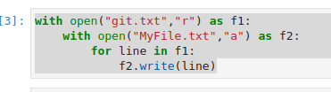
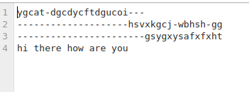

# copy-file
## AIM:
To write a python program for copying the contents from one file to another file.
## EQUIPEMENT'S REQUIRED: 
PC
Anaconda - Python 3.7
## ALGORITHM: 
Step 1:

Create a file and add some content into it.
Step 2:

Open file using with keyword/built-in function in read mode.
Step 3:

Use read() to read the contents of the file.
Step 4:

Split the lines using split().
Step 5:

Iterate the list and increment the count
Step 6:

Print the output.
## PROGRAM:
``` python
with open("git.txt","r") as f1:
    with open("MyFile.txt","a") as f2:
        for line in f1:
            f2.write(line)

```
### OUTPUT:




## RESULT:
Thus the program is written to copy the contents from one file to another file.